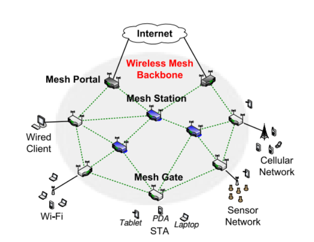

# Mesh Network
Rede mesh ou rede de malha, é uma alternativa de protocolo ao padrão 802.11 para diretrizes de tráfego de dados e voz além das redes a cabo ou infraestrutura wireless.

Uma rede de infraestrutura é composta de Access Point e clientes, os quais necessariamente devem utilizar aquele AP para trafegarem em uma rede. Uma rede mesh é composta de vários nós/roteadores, que passam a se comportar como uma única e grande rede, possibilitando que o cliente se conecte em qualquer um destes nós. Os nós têm a função de repetidores e cada nó está conectado a um ou mais dos outros nós. Desta maneira é possível transmitir mensagens de um nó a outro por diferentes caminhos.

## Topologia

Na essência, existem quatro tipos de agentes numa rede mesh. São eles:
* `Portal` são os routers que se comunicam com a internet diretamente.
* `Station` fazem a malha, estando ao centro da nuvem de routers. Comunicam-se com os Portal e Gate.
* `Gate` são responsáveis pelos Access Points.
* `STA` Dispositivos finais que se conectam ao AP via Wi-Fi ou cabo.

Routers com 3 ou mais antenas podem realizar funções de Station e Gate ao mesmo tempo. A grande vantagem é cobrir uma área maior com APs.

## Repositório
Este repositório está organizado em pastas. Seguindo as configurações originais da topologia.

### Equipamento
Para testes estamos utilizando o TL-WR842ND da TP-Link com o OpenWrt instalado.
